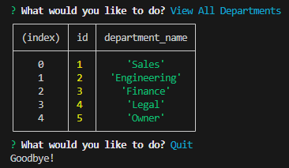

# brandon-sql-employee-tracker

[Video Demonstration](https://youtu.be/aRVz6EZluz8)

## Description

As a backend web developer, it is common to work with databases. It's important to understand all of the processes of `SQL`. This project is an employee tracker, which creates and interacts with a `MySQL` database to enter and retrieve information. `Inquirer` and `MySQL` are used in this project for question prompts. The hardest part was writing all of the promise queries from the database and setting up my database files. I learned a lot more about promises and how to interact with databases directly from the terminal / `MySQL Workbench`.

## Table of contents

- [Installation](#installation)
- [Usage](#usage)
- [License](#license)
- [Questions](#questions)

## Installation

1. Clone the repository from `GitHub`.
2. Install or have `Node.js` installed.
3. Install or have `MySQL` and set up an account.
4. Open the cloned repository in VSCode.
5. Open the project inside the integrated terminal.
6. Install all package dependencies using `npm i`.
   (This will install the modules `mysql`, `inquirer`, and `dotenv`.)

## Usage

1. Make sure to change the `connection.js` file in the `config` folder to your `MySQL` database information.
   (The `.env.EXAMPLE` file is an example of what to enter.)
2. Open the terminal in the `db` folder and run the command `mysql -u root -p`.
3. Enter your password to start `MySQL`.
4. Run `schema.sql` located in the `db` folder using `source schema.sql;` to initialize the tables.
5. Run `seeds.sql` located in the same folder using `source seeds.sql;` to populate the tables with example data.
6. Close that terminal.
7. Run the command `node server.js` in a newly opened `index.js` terminal.
8. Use the arrow keys to interact and enter to select any of the questions.
9. These prompts include viewing specific table data, adding employees/roles/departments, and updating employee roles.

### Example Home Page

### Other Example Tables

### Example Quit

## License

Licensed under [MIT](https://opensource.org/license/mit/)

## Questions

You are welcome to contact me with questions using the following:

- [GitHub Profile](https://github.com/bwing2)

- [Email](mailto:brandon.wing245@gmail.com)
